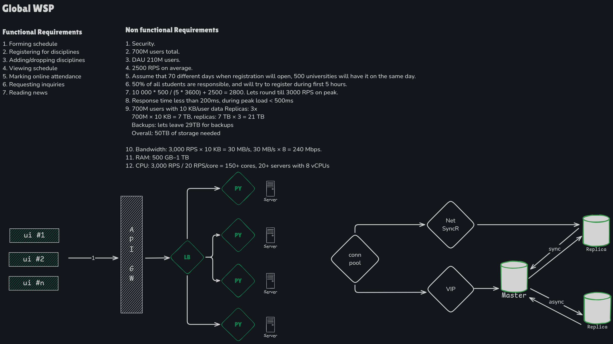

# GlobalWSP

### Functional requirements
1. Forming schedule
2. Registering for disciplines
3. Adding/dropping disciplines
4. Viewing schedule
5. Marking online attendance
6. Requesting inquiries
7. Reading news

### Non-functional requirements
1. Security.
2. 700M users total.
3. DAU 210M users.
4. 2500 RPS on average.
5. Assume that 70 different days when registration will open, 500 universities will have it on the same day.
6. 50% of all students are responsible, and will try to register during first 5 hours.
7. 10 000 * 500 / (5 * 3600) + 2500 = 2800. Lets round till 3000 RPS on peak.
8. Response time less than 200ms, during peak load < 500ms
9. 700M users with 10 KB/user data Replicas: 3x
    700M × 10 KB = 7 TB, replicas: 7 TB × 3 = 21 TB
    Backups: lets leave 29TB for backups
    Overall: 50TB of storage needed
10. Bandwidth: 3,000 RPS × 10 KB = 30 MB/s, 30 MB/s × 8 = 240 Mbps. 
11. RAM: 500 GB–1 TB
12. CPU: 3,000 RPS / 20 RPS/core = 150+ cores, 20+ servers with 8 vCPUs
